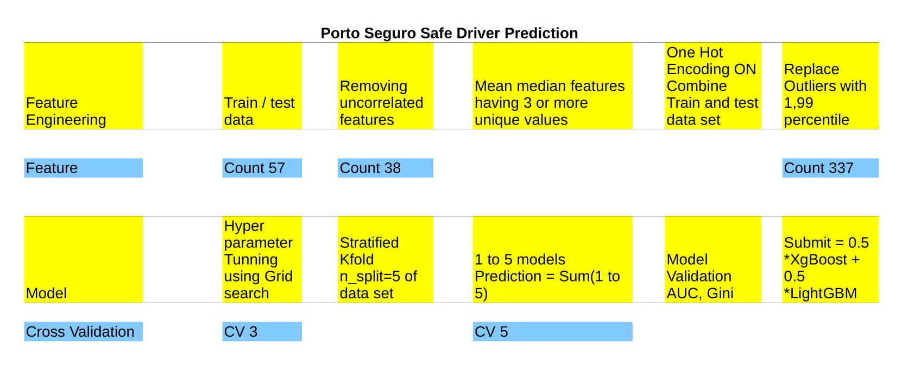

# [Porto Seguro Safe Driver Prediction](https://www.kaggle.com/c/porto-seguro-safe-driver-prediction)
	Porto Sergo Is Largest Auto And Homeowner Insurance Company. The aim of the project is to predict probability that a driver will intiate an auto insurance claim next yesr. A more accurate prediction will allow them to further tailor their prices, and hopefully make auto insurance coverage more accessible to more driver. 

## Data set Description
Porto Seguro provided close to 600k and 900k observation of train and test dataset respectively. They were 57 feature anonymized in order to protect company trade secrets, but we were given bit informaation about  The train and test data set contains feature with similar grouping are tagged with (e.g., ind, reg, car, cat, calc, bin). Values of  -1 indicate that the feature was missing from the observation. The target column in data set is whether or not claim was filed for that policy holder. The target variable is quite unbalanced, with only  %4 of  policyholders in training data filing claim within the year.

## Exploratory Data analysis
The feature name contains tag ind,car, contains category data type, there are few of them also numeric type. The feature contains bin tag is binary feature, feature having tag calc  is zero correlation with other variables, it has been drop from data set. About 2.5% of values are missing in total in each of the train and test data sets. 

## Feature Engineering
One hot encoding is performed on categorical variable. The outlier present in numeric feature are replaced by 
Mean and median of all variable is determined and add as new column in data set. 

## Modeling
The hyperparameter for machine learning algorithom is tuned using grid search method. The data set is split using Stratified Kfold. In each split model is created and predicted using that model. The final predicted value is average of all model. Logistic regression, Xgboost, Lightgbm algorithms are used. 

## Model validation
The model is evaluated on Gini coefficient, a popular measure in insurance industry which quantifies how well-ranked predicted probabilitie are relative to actual class labels. We are familiar with ROC AUC metric, it turns out simple relationship of gini is 2 * AUC -1 with ROC AUC  . The model is 5 times cross validated using Straigfied Kfold validation strategy, the average of predicted target variable is submitted. For logistic regression confusion matrix, ROC plot is used to evaluate model performance.
 

## Public Kernel
[Logistic Regression](https://www.kaggle.com/sudhirnl7/simple-logistic-model-porto)
[XgBoost](https://www.kaggle.com/sudhirnl7/xgboost-with-stratifiedkflod-lb-0-282)

## Parameter 
 XgBoost
"""
params = {
        'objective':'binary:logistic',        
        'max_depth':max_depth,
        'learning_rate':eta,
        'eval_metric':'auc',
        'min_child_weight':6,
        'subsample':0.8,
        'colsample_bytree':0.8,
        'seed':seed,
        'reg_lambda':1.3,
        'reg_alpha':8,
        'gamma':10,
        'scale_pos_weight':1.6
        #'n_thread':-1
    }
"""

 LightGBM
"""
param = {
            'objective':'binary',
            'boosting':'gbdt',
            'learning_rate':eta,            
            'metric':'auc',
            'bagging_fraction':0.7,
            #'bagging_freq':5,
            'bagging_seed':seed,
            'num_leaves':50,
            'feature_fraction':0.7,
            #'verbose':10,            
            'min_child_weight':6,
            'max_depth':max_depth,
            'reg_alpha':1.5, 
            'reg_lambda':5,
            'scale_pos_weight':9
            #'nthread':-1           
   	 }
"""

 Logistic Regression
"""
class_weight='balanced',C=0.003 
"""

## Flow Chart

## Out come of project:
This project give good opportunity to explore data set. Create new feature from data  set. I have submitted prediction more than 70 to kaggle wesite. My best gini score 0.282 on public LB and 0.287 on private LB. Overall my standing at end of competition is top 39%. 
